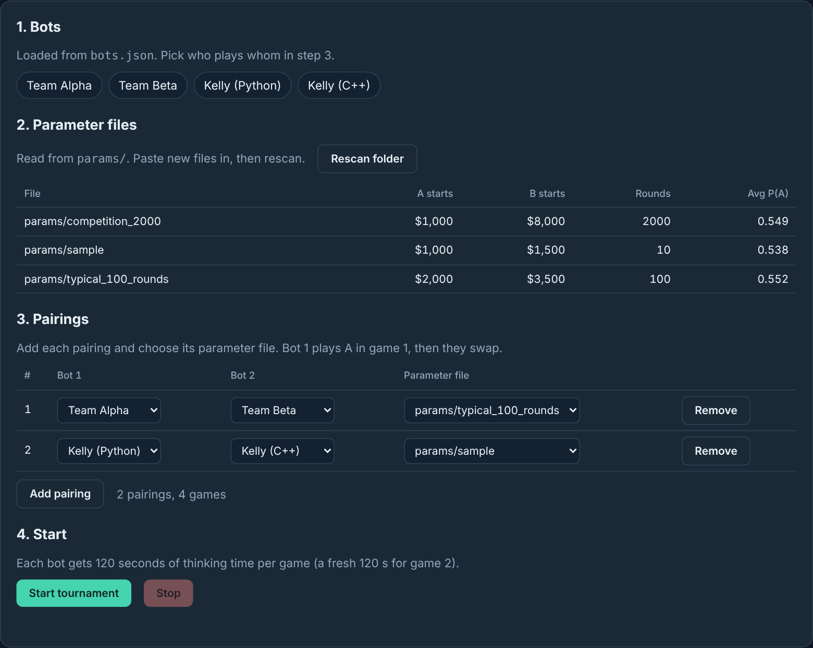
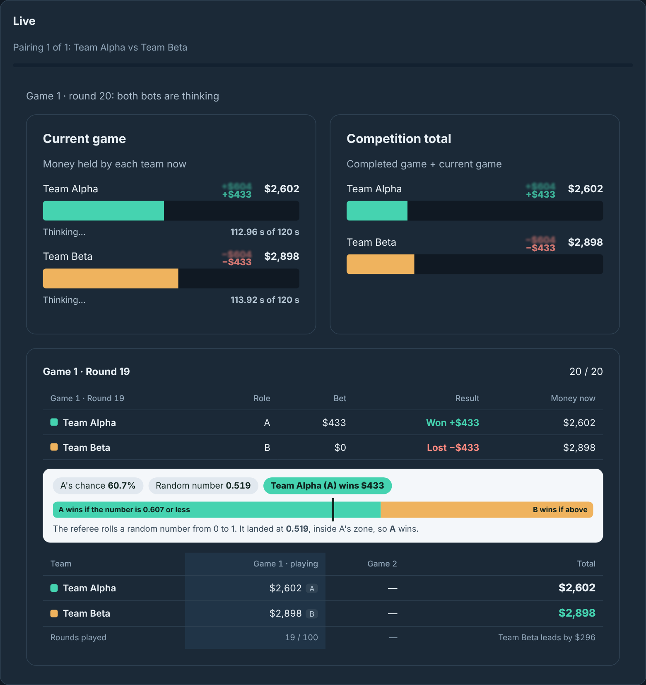
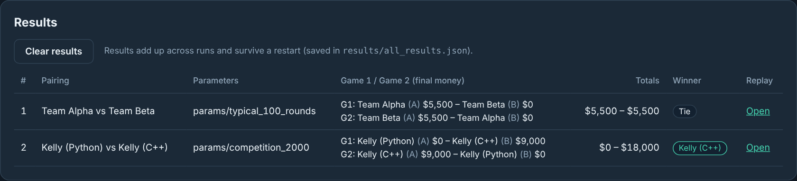
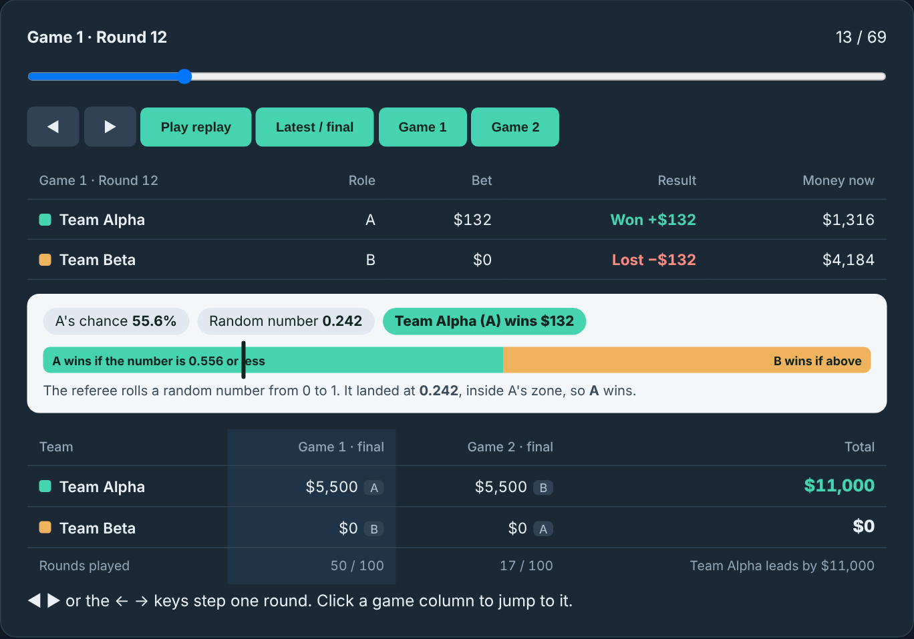

# Kelly Game

The architecture for the Heuristic Problem Solving game **Kelly** (rules on the course website):
a referee that runs the bots, a live dashboard in the browser, saved replays, and starter bots in
**Python, C++ and Julia**.

| | |
|---|---|
| **Runs on** | Mac, Linux (including crunchy5) and Windows |
| **Needs** | Python 3.8+, standard library only (nothing to `pip install`) |
| **Clock** | 120 seconds of thinking time per bot per game |
| **Bet limit** | 20% of your current money; a bigger bet is lowered to 20% |
| **A pairing** | 2 games with roles swapped; your score is your money from both games added together |

**Contents:** [Quick start](#quick-start) ·
[The dashboard](#the-dashboard) ·
[Other ways to run](#other-ways-to-run) ·
[Making a bot](#making-a-bot) ·
[Rules the referee enforces](#rules-the-referee-enforces) ·
[Requirements](#requirements)

---

## Quick start

```sh
git clone https://github.com/swapn1ll/Kelly_game.git
cd Kelly_game
python3 start.py
```

Open **http://127.0.0.1:8090** in your browser. Run this from inside the `Kelly_game` folder. Stop the server with **Ctrl+C**.
(On Windows, type `python` instead of `python3`.)

---

## The dashboard

The page has four steps, then a live view and the results.


*Setup: the bots from `bots.json`, the parameter files in `params/`, and the pairings you add.*

<details>
<summary><b>Setting up a tournament, step by step</b> (click to open)</summary>
<br>

1. **Bots** are read from `bots.json`.
2. **Parameter files** are read from `params/`. Drop a new file in and press **Rescan folder**.
   Each file holds A's starting money, B's starting money, then the probability that A wins
   each round. The number of rounds is simply how many probabilities there are.
   Or press **Add your own**, type a name, both starting amounts and the probabilities, and
   **Save**: the file is checked, saved to `params/` and appears in the list straight away. To make a practice file:
   `python3 start.py params --a 2000 --b 3500 --rounds 100 --out params/my_game.txt`
3. **Pairings:** press **Add pairing** and pick Bot 1, Bot 2 and a parameter file for each.
   Bot 1 plays A in game 1; the roles swap for game 2.
4. **Start tournament.** The page scrolls down to the live view. **Stop** ends the run early;
   finished pairings are kept.

</details>


*Live view: each team's money as bars, both clocks ticking while a bot thinks, and +/- popups after every round.
Below it, who won the last round, why (the random number against A's chance), and the game scoreboard.*

<details>
<summary><b>What the live view shows</b> (click to open)</summary>
<br>

- **Current game:** each team's money right now, and how much of its 120 seconds is left.
  The clock of a bot that is thinking counts down live and says *Thinking...*
- **Competition total:** the finished game plus the current one, so you can see who is ahead in the pairing.
- **Last round:** each team's role, bet, and how much it won or lost.
- **Random number box:** A's chance this round, the random number the referee rolled, and where it
  landed on the 0-to-1 ruler. A wins if the number is at most A's chance.
- **Game scoreboard:** game 1, game 2 and the total for each team.

The live view always follows the latest round. To look back at earlier rounds, open the replay.

</details>


*Results: every finished pairing with both games, the totals, the winner and a link to its replay.*

<details>
<summary><b>Results and replays</b> (click to open)</summary>
<br>

- Results **add up across runs**: run one pairing now and another later, and both stay in the table.
  They survive a server restart (saved in `results/all_results.json`). **Clear results** starts over
  and keeps a backup copy in `results/`.
- Each run's files are also saved in `results/tournament/<date-time>/`, one folder per pairing.
- **Open** shows the replay: the same view as live, plus a slider, step buttons (and the arrow keys),
  **Play replay**, and **Game 1** / **Game 2** buttons.



</details>

---

## Other ways to run

<details>
<summary><b>One match from the terminal</b></summary>
<br>

```sh
python3 start.py match "Kelly (Python)" "Kelly (C++)" --config params/sample.txt
```

Plays both games and opens the replay in your browser. Add `--no-browser` to skip that.

</details>

<details>
<summary><b>A whole tournament without the browser</b></summary>
<br>

```sh
python3 start.py tournament --config params/competition_2000.txt
python3 start.py tournament --bots "Kelly (Python)" "Kelly (C++)"
```

Plays every pair of bots (or the ones you list) and prints each result. Without `--config` it rotates
through the files in `params/`. Results go to `results/tournament/<date-time>/`.

</details>

<details>
<summary><b>On crunchy5</b></summary>
<br>

Clone the repository on crunchy5 and build C++ bots there (a Mac build does not run on Linux).
Start the dashboard on crunchy5:

```sh
python3 start.py --port 8090
```

Then, in a second terminal on your laptop (leave it open):

```sh
ssh -J YOUR_NETID@access.cims.nyu.edu -L 8090:localhost:8090 YOUR_NETID@crunchy5.cims.nyu.edu
```

and open **http://localhost:8090** on your laptop. If 8090 is taken, pick another number in both commands.

</details>

---

## Making a bot

Starter bots are in `bots/templates/` (one file each, `choose_bet` returns 0 until you write your strategy).
Working example bots, plain Kelly in all three languages, are in `bots/samples/`.

<details>
<summary><b>Step 1: Copy a template</b></summary>
<br>

Copy the folder for your language into `bots/` under your own name:

| Language | Copy | Your file |
|---|---|---|
| Python | `bots/templates/python` | `bot.py` |
| C++ | `bots/templates/cpp` | `bot.cpp` (+ `build.py`, which compiles it) |
| Julia | `bots/templates/julia` | `bot.jl` |

For example: `bots/templates/python` → `bots/alice/`.

</details>

<details>
<summary><b>Step 2: Write <code>choose_bet</code></b></summary>
<br>

Your file has a section marked `EDIT ONLY THIS SECTION`. Write your strategy in `choose_bet(s)` and
return your bet as a whole number. You may add helper functions and imports there. The rest of the file
talks to the referee; leave it alone.

Every round, `choose_bet` receives:

| Field | Meaning |
|---|---|
| `role` | `A` or `B` (you play A in one game and B in the other) |
| `round` | this round, starting at 0 |
| `probs` | the probability that **A** wins each round, for all rounds (Julia: `probs[round + 1]`) |
| `my_capital`, `opp_capital` | your money and your opponent's money now |
| `time_used` | seconds your `choose_bet` has used so far this game, timed by your own bot |

These are the same inputs as last year's architecture. You are not told the opponent's name or bets.

The Python starter looks like this:

```python
def choose_bet(s):
    # TODO: your strategy here
    return 0
```

Do not print to standard output: it carries your bets. Print debugging output to standard error.

</details>

<details>
<summary><b>Step 3: Add your bot to <code>bots.json</code></b></summary>
<br>

`bots.json` is the roster: the referee runs exactly the bots listed there. Add one line for yours:

```json
{"name": "Alice", "cwd": "bots/alice", "command": ["{python}", "bot.py"]}
{"name": "Bob",   "cwd": "bots/bob",   "command": ["./bot"], "build": ["{python}", "build.py"]}
{"name": "Carol", "cwd": "bots/carol", "command": ["julia", "--startup-file=no", "bot.jl"]}
```

- `name`: shown on the dashboard; must be unique.
- `cwd`: your bot's folder. `command`: how to start it, run from that folder. `{python}` means the Python
  running the referee; `./bot` becomes `bot.exe` on Windows.
- `build` (C++): compiles your bot before the tournament (not timed), and again only when your files change.

Restart the server (or refresh the page) and your bot appears in the pairing menus.

</details>

<details>
<summary><b>Step 4: Test it</b></summary>
<br>

Play against a sample bot:

```sh
python3 start.py match "Alice" "Kelly (Python)" --config params/typical_100_rounds.txt
```

Run the automated checks (rules, referee, templates):

```sh
python3 -m unittest discover -s tests -v
```

The Julia check is skipped if Julia is not installed.

</details>

<details>
<summary><b>Step 5: Hand it in</b></summary>
<br>

Send me your whole bot folder, your bot's name, your language and version, and any setup steps.
If your bot needs anything beyond the standard library (for example numpy), tell me before the competition.

</details>

---

## Rules the referee enforces

- **Rounds:** both bots bet at the same time. The bets are added together into a pot, a random number
  from 0 to 1 is rolled, and **A wins if it is at most A's probability** for that round, otherwise B wins.
  The loser pays the pot, or everything they have if that is less.
- **A game ends** when someone has $0 or the rounds run out.
- **Bets:** a whole number from 0 to 20% of your current money (rounded down). A bigger bet is
  **lowered to 20%** and play continues.
- **Clock:** 120 seconds per bot per game, with a fresh 120 s for game 2. Each round both bots get their
  message at the same moment, and each is timed from its own message to its own answer, so a fast bot
  never pays for a slow one. Neither sees the other's bet until both have bet.
- **Free startup:** each bot gets up to 30 seconds to start (not on its clock), enough for Julia.
- **New process every game:** your bot keeps its variables between rounds of a game, but not between games.
- **Forfeit** (all of that game's money goes to the opponent): running out of time, a crash, a negative or
  non-whole-number bet, invalid output, or more than 64 KB of output in one reply.
  If both bots fail in the same round, the game stops with the money as it is.
- **Random numbers:** fresh for every game, from a secret seed picked for each pairing. The seed is hidden
  until that pairing is over, then saved with its results.

<details>
<summary><b>The messages between the referee and a bot</b> (for the curious; the templates handle this)</summary>
<br>

One JSON object per line:

```
referee -> bot   {"type":"start","role":"A","probs":[...],"my_capital":1000,"opp_capital":1500}
bot -> referee   {"ready":true}                                  (not timed, up to 30 s)
referee -> bot   {"type":"bet","round":0,"my_capital":1000,"opp_capital":1500}
bot -> referee   {"bet":40}                                      (timed)
```

</details>

---

## Requirements

| Language | Version | How to get it |
|---|---|---|
| Python | **3.8 or newer** | python.org or Anaconda. Check: `python3 --version` (Windows: `python --version`) |
| C++ | a **C++17** compiler (g++ 7+, clang 5+, Visual Studio 2017+) | Mac: `xcode-select --install`. Windows: MinGW-w64 (`g++`) or Visual Studio Build Tools. Linux: `g++` |
| Julia | **1.6 or newer** | julialang.org. Check: `julia --version` |

Tested with Python 3.8 and 3.13, and g++ 13.

<details>
<summary><b>What's in each folder</b></summary>
<br>

| Folder / file | What's in it |
|---|---|
| `start.py` | Starts everything: the dashboard, a match, a tournament, or a new parameter file |
| `referee/` | The Python code: `engine.py` (rules), `runner.py` (runs bots, keeps clocks, writes replays), `server.py` (dashboard), `tournament.py`, `match.py`, `make_params.py` |
| `dashboard/` | The web pages (`index.html`, `replay.html`) and the screenshots in this README |
| `bots/` | `templates/` (starter bots to copy) and `samples/` (working Kelly bots) |
| `params/` | Parameter files: `sample` (10 rounds), `typical_100_rounds`, `competition_2000` |
| `tests/` | Automated checks |
| `bots.json` | The roster of bots the referee runs |

</details>
